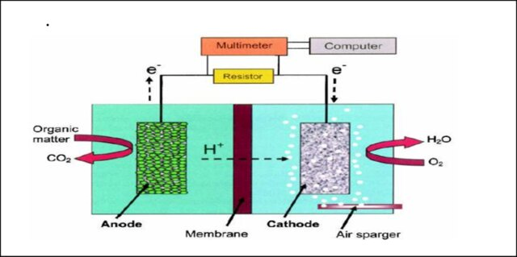
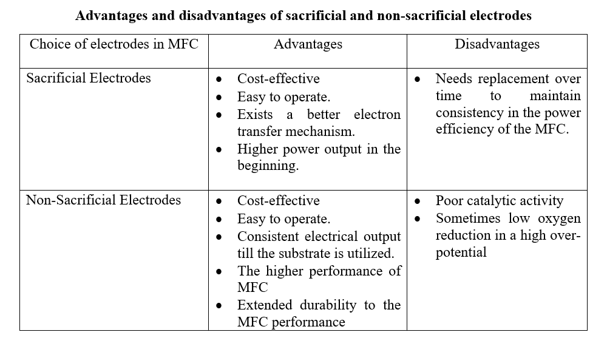

### Introduction
Microbial fuel cells (MFC) have been capturing the attention of the scientific community as they transform organic waste into electricity by microbial catalysis at the anode and enzymatic electrochemical reactions at the cathode. However, the practical implementation of MFCs is limited due to their inefficiency in performance and the design properties need to be scaled up to enhance their performance. It has been noted that the power output depends on the assembly of the components of the MFC, and research has been progressing to find alternative solutions for improving the productivity of MFC with effective electrode materials and robust microorganisms for full-scale application. 

### Theory
 
MFC has the potential to become a major renewable energy resource utilizing the organic pollutants in wastewater. The performance of the MFC is the critical factor to be considered while constructing an MFC. As mentioned in the previous experiments, it has been noted that the MFC performance is directly linked to the kinetics of the electrode reactions and thus the performance depends on the material composition of the electrodes. A wide range of materials and components have been tested to improve the performance of MFCs on a laboratory scale. The selection of microbial load as exoelectricigens, the substrate used in the fuel cell, and the type of proton exchange membrane (PEM) used directly influence the performance of MFCs. Recent research has been focusing on the type of electrode material used for improving performance thereby improving the potential commercialization of MFCs. 

This experiment focuses on understanding the types of electrodes that can be used in the MFC and studying the resultant changes in the power output for each electrode combination.

#### Importance of electrodes in MFC 

A typical MFC consists of an anode and a cathode separated by a proton exchange membrane (PEM). In general, the biofilm produced at the anode electrode catalysis the conversion of chemical energy into electrical energy by producing electrons and protons and the oxygen in the cathode undergoes reduction to form water molecules (Fig.1). This indicates that the efficiency of an MFC depends on the extracellular electron transfer mechanism and the transport of electrons to electrodes takes place in different ways. Some microorganisms, such as Geobacter and Shewanella, known as exoelectrogens deliver electrons from their oxidative metabolic pathways to the external environment, and are directly transferred to the electrode surface.

&nbsp;

Figure 1: Design of MFC

Adapted from: Teli, N.C., Bhalerao, S.A., Didwana, V.S. and Verma, D.R., 2016. Microbial fuel cell: a source of sustainable energy. BIOVISTAS Int J Biol Res, 5(6), pp.1-12.

Microorganisms such as Pseudomonas secrete chemicals such as flavins that are referred to as shuttle molecules to transfer electrons from the outer membrane of bacteria to the electrode surface. Geobacter genera possess conductive appendages like nanowires for facilitating electron transfer outside the cell. 

#### Composition of electrode materials in MFC

The selection of the proper electrode material is a crucial factor that determines the performance efficiency of MFCs which depends on bacterial adhesion, electron transfer, and electrochemical efficiency. The material cost of the electrode must be reduced with an increase in power densities. The cathode and anode should possess certain properties to improve the power efficiency of the system. One factor is the higher surface area of the electrodes that decreases the resistance to the flow of electrons thereby enhancing the efficiency of the MFC. Porous electrode material will result in a decrease in the electrical conductivity of the material. Also, high electrical conductivity of the electrode material is needed to ensure electron flow with less resistance. The high surface roughness of the electrode material increases durability thus resulting in biofouling and reducing the long-term performance of the MFC. The chemical and mechanical stability of the electrodes must be considered to improve the robustness of the MFC.

#### Sacrificial Electrodes

The electrodes that are used in various electrochemical processes that get consumed or corroded during operational time are referred to as sacrificial electrodes. In an MFC design and construction, as with all the MFCs, the electron donor is the sacrificial electrode that provides electrons to the microbial community present in the anodic chamber. The electron transfer mechanism occurs either through direct contact or through soluble electron shuttles. Usually, the sacrificial electrodes function to enhance the rate of electron transfer from the microbial metabolism to the electrode surface improving the overall performance and efficiency of the MFC. The sacrificial electrodes may saturate with electrodes and get degraded over time. It needs to be replaced periodically to ensure a constant flow of electrons and resultant power generation. The best example to show the functioning of sacrificial electrodes are combination of aluminum and copper as cathode and anode. Zinc and Manganese are other examples of sacrificial electrodes. In MFC, the role of sacrificial electrodes is to produce a higher output in the initial phase which gradually reduces over time due to the oxidation of the electrode.

#### Non-Sacrificial Electrodes

The electrodes that are not intentionally consumed or corroded during operation time are referred to as non-sacrificial electrodes. The non-sacrificial electrodes are selected in electrochemical reactions to ensure structural integrity and functionality over extended periods of usage. In an MFC, the use of non-sacrificial electrodes ensures durability with long-term performance efficiency. Commonly used non-sacrificial electrodes in MFC are graphite or carbon cloth which possess high conductivity, chemical stability, and resistance to corrosive properties leading to long-term operation. Carbon electrodes, such as graphite or carbon cloth, are widely used as non-sacrificial electrodes in many electrochemical systems, including microbial fuel cells (MFCs), electrolysis cells, and electrochemical sensors. Carbon electrodes are chosen for their high conductivity, chemical stability, and resistance to corrosion, making them suitable for long-term operation. Other examples included platinum, gold, titanium, and stainless-steel electrodes. Studies have shown that the packed and brush design of the anodes provides higher power output when compared to planar-type anodes by increasing the anode-specific surface area and consequently the volumetric density of exoelectrogenic bacteria. The brush configuration also has high porosity that helps the microbial load hold onto the anode structure. In an MFC, the non-sacrificial electrodes provide consistent electrical power output over time. 

&nbsp;
