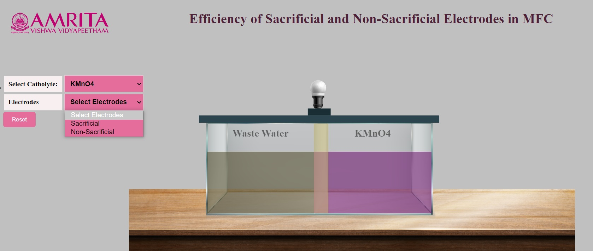
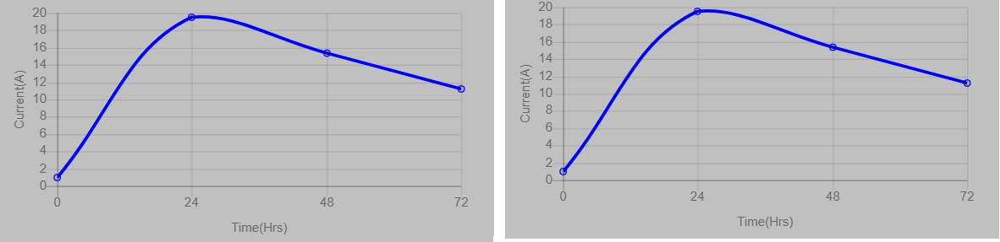

### Procedure

1. Users can open the simulator window. In the MFC chamber, the anodic chamber is filled with wastewater. 

&nbsp;

2. Users have the option to select catholyte. Catholyte can be either KMO4 or Water.

&nbsp;
 
3. Here, KMO4 is selected as Catholyte. Upon selection, the cathodic chamber gets filled with KMNO4 solution. The PEM used is nutrient agar with Bacillus subtilis. Then users have the choice of electrodes. Users can choose either sacrificial or non-sacrificial electrodes. 

&nbsp;

 
4. When sacrificial electrodes are selected, the electrode combination is Copper as anode and Aluminium as cathode. Users can see the production of electricity by the glow of the bulb attached to the MFC system. A graph is also plotted with time on the x-axis and current on the y-axis.

&nbsp;

5. As sacrificial electrodes are selected, the anode electrode undergoes oxidation upon continuous action of microorganisms. The microorganism in the wastewater produces electrons which move towards the anode and start acting on the anode. Users can visualize the oxidation of copper electrodes over time. At the same time, users can visualize the change in the structure of the aluminium electrode due to the redox reaction at the cathode chamber. 

&nbsp;

 

6. In the graph, users can see the gradual change in the production of current depending on the time duration. When the oxidation happens, there will be higher production of current at a particular time (24 hours), and the continuous oxidation results (48-72 hours) in reduced current production as the electrodes are being sacrificed. The change in the current production is indicated by the changes in the glow of the bulb attached to the system. Also, users can see the peak in the graph which is representative of higher current production at a specified time. 

&nbsp;

7. Users can click on the reset button and can change the parameters. 

8. When non-sacrificial electrodes are selected, the electrode combination shown is carbon brush as both anode and cathode. Users can see the production of electricity by the glow of the bulb attached to the MFC system. At the initial hours, the current production is very low which increases over time. A graph is also plotted with time on the x-axis and current on the y-axis. The fluctuations in the graph represent the change in current production at different time intervals. 

&nbsp;

 

9. As non-sacrificial electrodes are selected, the anode electrode undergoes oxidation upon continuous action of microorganisms. The microorganism in the wastewater produces electrons which move towards the anode and the protons move through the PEM and a redox reaction occurs at the cathode. Since the electrodes are non-sacrificial, there is no change in the structure of the electrodes selected. The change in the current production is indicated by the changes in the changes in the glow of the bulb attached to the system. 

&nbsp;

10. In the graph, users can see the gradual change in the production of current depending on the time duration. When the oxidation happens, there will be higher production of current at a particular time (24-48 hours), and the continuous oxidation results (72 hours) in reduced current production as the electrodes are being sacrificed. The change in the current production is indicated by the changes in the glow of the bulb attached to the system. Also, users can see the peak in the graph which is representative of higher current production at a specified time. 

&nbsp;

11.	The results indicated that the use of non-sacrificial electrodes will result in the consistent production of electric current when compared to the sacrificial electrodes. Even though the sacrificial electrodes produced a higher current, they need to be replaced to continue the experiment output. Non-sacrificial electrodes need not be replaced, they will utilize the entire substrate for maximum current production. 
